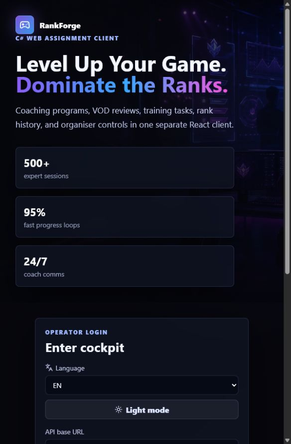

# RankForge Client

[](https://github.com/MarSich13/rankforge-client/actions/workflows/ci.yml)

RankForge Client is a responsive React frontend for a coaching and competitive-rank management platform. It brings training plans, coaching sessions, VOD reviews, progress tracking, messaging, and organiser tools into a role-aware interface.



## Highlights

- Student, coach, and administrator workflows
- Coaching catalog and enrolment management
- Training tasks, rank history, and progress dashboards
- VOD review and messaging interfaces
- Organiser controls for programs and user-facing content
- English, Estonian, and Russian UI translations
- Light and dark themes
- JWT access-token refresh flow
- Production-ready Docker and Nginx configuration

## Tech stack

- React 19
- Vite 7
- Lucide React
- Plain CSS with responsive layouts
- Docker, Docker Compose, and Nginx

## Getting started

Requirements: Node.js 20+ and npm.

```bash
npm ci
npm run dev
```

The development server is available at `http://127.0.0.1:5173` by default. The API URL can be changed from the login screen or provided at build time:

```bash
VITE_API_URL=http://127.0.0.1:5099 npm run build
```

This repository contains the client application only and requires a compatible RankForge API for authenticated features.

## Production build

```bash
npm run build
npm run preview
```

To build and serve the client with Docker:

```bash
docker compose -f docker-compose.vps.yml up --build
```

## Project structure

```text
src/
├── api/          API client and token refresh
├── components/   Shared UI and layout components
├── features/     Role-oriented application screens
├── i18n/         UI translations and preferences
└── utils/        Formatting and role helpers
```

## Validation

Every push and pull request is checked with a clean dependency install, production build, and npm security audit through GitHub Actions.
